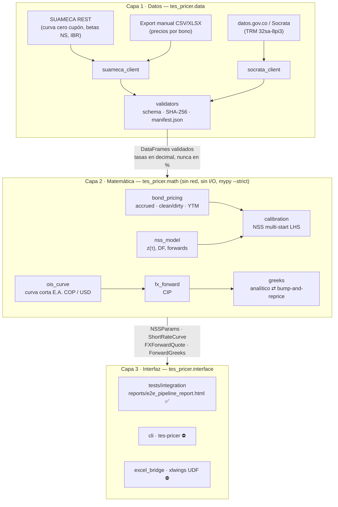

# TES Curve Calibration

[](https://github.com/CarlosDsuarez/tes-curve-calibration/actions/workflows/ci.yml)
[](pyproject.toml)
[](scripts/check_coverage.py)
[](pyproject.toml)

> El badge de cobertura muestra el **piso exigido en CI**, no una medición
> publicada: el workflow genera `coverage.xml` y falla por debajo de 85 %
> (paquete) y 95 % (`tes_pricer.math`), pero no hay Codecov/Coveralls
> configurado. Ver [Tests y verificación](#tests-y-verificación).

Calibración Nelson-Siegel-Svensson sobre TES tasa fija en pesos, curva corta
COP a partir de fixings IBR, y valoración de forwards USD/COP bajo paridad
cubierta de tasas de interés, con griegas reconciliadas contra
bump-and-reprice. El núcleo numérico está verificado contra QuantLib donde
QuantLib tiene un referente equivalente, y contra el *Informe Diario de Deuda
Pública* de MinHacienda donde no lo tiene.

---

## Descripción

Una mesa de renta fija o derivados en Colombia necesita, cada día, tres
objetos que dependen uno del otro: una curva cero cupón de TES para descontar
y marcar bonos, una curva corta en COP (IBR) para financiación y forwards, y
el forward USD/COP que resulta de cruzar esa curva con la de USD. Este
repositorio construye los tres a partir de **fuentes públicas colombianas**
—Banco de la República (SUAMECA), MinHacienda y datos.gov.co— y documenta con
precisión dónde esas fuentes públicas se quedan cortas frente a lo que una
mesa consume de un vendor.

El problema que resuelve no es solo "ajustar una curva": es hacerlo de forma
**reproducible y auditable**. Cada dato de mercado que entra queda archivado
con su SHA-256 en `data/manifest.json`; el núcleo numérico
(`tes_pricer.math`) no puede tocar la red, y eso está impuesto por el linter,
por un test que parsea el AST de cada módulo y por `mypy --strict`. Una
calibración de hace tres meses se vuelve a correr offline y da el mismo
número.

Está pensado para dos lectores. Para un **quant o desarrollador de mesa**, es
una librería Python con contratos explícitos sobre convenciones (ACT/365,
efectiva anual vs. continua, COP por USD) y una batería de tests que
convierte cada convención en una aserción. Para un **entrevistador técnico**,
es un proyecto de portafolio que prefiere declarar sus limitaciones a
esconderlas: la sección [Limitaciones conocidas](#limitaciones-conocidas) es
la más larga del documento a propósito.

## Estado actual

Honesto y concreto. Lo que corre hoy, en un proceso, sobre un snapshot real
del 14 de agosto de 2026:

| Etapa | Módulo | Estado |
| --- | --- | --- |
| Ingesta de precios por bono (export manual CSV/XLSX) + manifest de procedencia | `data.suameca_client`, `data.validators` | ✅ |
| Series SUAMECA (curva cero cupón 1/5/10y, betas NS, IBR por plazo) | `data.suameca_client.fetch_series` | ✅ verificado en vivo 2026-09-08 |
| TRM desde datos.gov.co (Socrata `32sa-8pi3`) | `data.socrata_client.fetch_trm` | ✅ |
| Precio limpio/sucio, cupón corrido, YTM (Brent) | `math.bond_pricing` | ✅ |
| Curva NSS: `z(τ)`, DF, forwards instantáneos y a plazo | `math.nss_model` | ✅ benchmark QuantLib |
| Calibración NSS multi-start (Latin Hypercube, `trf`) | `math.calibration` | ✅ |
| Curva corta COP/USD por interpolación de fixings (E.A. ACT/365) | `math.ois_curve` | ✅ |
| Forward USD/COP bajo CIP, puntos forward, chequeo de signo | `math.fx_forward` | ✅ |
| Griegas del forward (delta, gamma, DV01 COP/USD, theta), analítico vs bump | `math.greeks.compute_forward_greeks` | ✅ |
| Test end-to-end con reporte de evidencia HTML/MD | `tests/integration` | ✅ 30/30 checks |
| Bootstrap OIS arbitraje-libre desde swaps par IBR | `math.ois_bootstrap` | ⛔ stub (v2) |
| Convenciones de conteo de días y calendario colombiano como módulo | `math.day_count` | ⛔ stub (`bond_pricing` resuelve ACT/365 localmente) |
| Garman-Kohlhagen, vol implícita, griegas de opciones FX | `math.fx_forward`, `math.greeks` | ⛔ stub |
| DV01, key-rate durations, convexidad de bonos | `math.greeks` | ⛔ stub |
| Validadores de series TES/IBR/TRM (`validate_tes_prices`, …) | `data.validators` | ⛔ stub (la validación del universo YAML sí está) |
| CLI `tes-pricer` y `scripts/run_daily_calibration.py` | `interface.cli`, `scripts/` | ⛔ parsers listos, handlers son stubs |
| Puente Excel (`xlwings` UDFs) y `excel/tes_toolkit.xlsm` | `interface.excel_bridge` | ⛔ stub; el `.xlsm` es un placeholder |

Todo lo marcado ⛔ lanza `NotImplementedError` y tiene tests
`xfail(strict=True)` que se ponen en rojo el día que la implementación llegue
sin cumplir el contrato. La única forma de correr el pipeline completo hoy es
la **API de librería** (ejemplo abajo) o el test end-to-end; no hay entrypoint
de producción.

## Arquitectura

Una decisión de la que se desprende todo lo demás: **el núcleo numérico
nunca toca la red.** Tres capas, con una frontera de datos explícita entre
cada par.



La frontera Datos → Matemática se impone tres veces, porque una convención
que solo está escrita es una convención que se erosiona:

1. `ruff` (`flake8-tidy-imports` banned-api): `requests` y `sodapy` están
   prohibidos fuera de `tes_pricer.data` (ver `pyproject.toml`).
2. `tests/unit/test_architecture.py` parsea el AST de cada módulo de `math/`
   y falla si aparece un import de red o una lectura de URL.
3. `mypy --strict` solo sobre `tes_pricer.math`: un `Any` que se cuele desde
   un payload sin tipar se vuelve error de tipos, no un precio silenciosamente
   mal.

La frontera Matemática → Interfaz es de objetos inmutables
(`@dataclass(frozen=True, slots=True)`): `NSSParams`, `NSSCalibrationResult`,
`ShortRateCurve`, `FXForwardQuote`, `ForwardGreeks`. Cada uno valida sus
invariantes en `__post_init__` (un `FXForwardQuote` cuyos puntos forward
contradicen el diferencial de tasas emite `ForwardPointsSignWarning` sin
importar quién lo construyó).

### Convenciones que cruzan las fronteras

Las que cuestan dos puntos básicos silenciosos si se rompen, por eso se
declaran una vez y se testean:

| Convención | Valor | Dónde se impone |
| --- | --- | --- |
| TES tasa fija | cupón anual, **ACT/365**, yield efectiva anual, precios por 100 | `bond_pricing`, `tes_referencia.yaml` |
| Curva NSS | **continuamente compuesta**, `DF = exp(-zτ)` | `nss_model` (docstring + benchmark QuantLib) |
| Curva corta e IBR | **efectiva anual ACT/365**, `DF = (1+r)^-τ` | `ois_curve`, `fx_forward` |
| Conversión entre ambas | `z = ln(1+r)`, `r = exp(z) - 1`; **nunca implícita** (≈46 bp de error al 10 %) | `fx_forward` docstring; test e2e "carry compounded, not exponentiated" |
| Tasas entre módulos | siempre **decimales** (`0.1208`), nunca porcentajes | validadores, test e2e |
| USD/COP | **COP por USD**; USD es la moneda extranjera en CIP | `fx_forward` |
| Puntos forward | `(F − S) × 10 000` (`FORWARD_POINTS_SCALE`); las mesas COP suelen cotizar en COP planos | `fx_forward.forward_points(scale=…)` |

## Instalación

Requiere Python **3.11 o 3.12** (el techo `<3.13` lo fija el resto de
dependencias, no QuantLib) y [Poetry](https://python-poetry.org/).

```bash
git clone https://github.com/CarlosDsuarez/tes-curve-calibration.git
cd tes-curve-calibration
poetry install --with dev,test
poetry run pre-commit install
```

`--with test` instala `QuantLib` (ruedas `abi3`, no hay que compilar nada) y
`responses` para los tests de los clientes HTTP. Sin `--with test` la librería
funciona igual: **nada bajo `src/` importa QuantLib**; es el árbitro, no una
dependencia.

Verificación rápida:

```bash
poetry run pytest
```

Ese es el tier offline por defecto (sin red, sin QuantLib).

### Configuración: `.env`

```bash
cp .env.example .env
```

Todas las variables son opcionales para correr el pipeline offline; importan
cuando se toca una fuente en vivo:

| Variable | Para qué | Nota |
| --- | --- | --- |
| `SUAMECA_BASE_URL` | Raíz del servicio REST de Banco de la República | Endpoint interno de un SPA, sin autenticación; ver [`docs/suameca_reverse_engineering.md`](docs/suameca_reverse_engineering.md) |
| `SUAMECA_MANUAL_EXPORT_PATH` | CSV/XLSX con precios por bono | **Obligatorio para precios**: SUAMECA no los publica. En blanco, `fetch_tes_prices` falla ruidosamente |
| `SOCRATA_APP_TOKEN` | Token datos.gov.co | Opcional; solo sube el rate limit |
| `SOCRATA_TRM_DATASET_ID` | Dataset TRM | `32sa-8pi3` (SFC); `mcec-87by` es un espejo idéntico |
| `SOCRATA_IBR_DATASET_ID` | — | Déjelo en blanco: el único asset IBR de datos.gov.co es un stub `href` sin filas (HTTP 403) |
| `TES_PRICER_ALLOW_NETWORK` | `1` habilita los tests marcados `network` | CI lo fija en `0` |

## Ejemplo de uso end-to-end

Código real, ejecutable desde la raíz del repositorio sobre el snapshot
congelado del 14 de agosto de 2026 (16 TES tasa fija, precios del *Informe
Diario de Deuda Pública* de MinHacienda; TRM de la SFC vía datos.gov.co). Los
pilares de las curvas cortas del snapshot son **supuestos de escenario**, no
fixings —ver [`PROVENANCE.md`](tests/fixtures/e2e_20260814/PROVENANCE.md)—,
lo que es precisamente la limitación (b) de la sección
[Limitaciones conocidas](#limitaciones-conocidas).

```python
from datetime import date, timedelta
from pathlib import Path

import yaml

from tes_pricer.data.suameca_client import SuamecaClient
from tes_pricer.math.bond_pricing import BondTerms, yield_to_maturity
from tes_pricer.math.calibration import calibrate_nss
from tes_pricer.math.day_count import DayCount
from tes_pricer.math.fx_forward import price_fx_forward
from tes_pricer.math.greeks import compute_forward_greeks
from tes_pricer.math.nss_model import nss_zero_rate
from tes_pricer.math.ois_curve import build_cop_short_curve, build_usd_short_curve

FIXTURES = Path("tests/fixtures/e2e_20260814")
VALUATION = date(2026, 8, 14)

# --- 1. Capa de datos: export manual -> DataFrame validado + manifest ---------
# SUAMECA no publica precios por bono, asi que la fuente es un CSV exportado de
# un terminal (formato colombiano: ';', coma decimal, dd/mm/yyyy). El loader lo
# valida, lo archiva y registra su SHA-256 en data/manifest.json.
client = SuamecaClient(
    raw_cache_dir="data/raw",
    manifest_path="data/manifest.json",
    manual_export_path=FIXTURES / "tes_precios_2026-08-14.csv",
)
prices = client.load_from_manual_export(FIXTURES / "tes_precios_2026-08-14.csv")
print(f"{len(prices)} bonos ingeridos; columnas: {', '.join(prices.columns)}")

# --- 2. Terminos de cada bono y YTM implicito en el precio limpio -------------
reference = yaml.safe_load(Path("src/tes_pricer/config/tes_referencia.yaml").read_text())
terms = {
    b["nemotecnico"]: BondTerms(
        isin=b["nemotecnico"],
        issue_date=date.fromisoformat(b["fecha_emision"]),
        maturity_date=date.fromisoformat(b["fecha_vencimiento"]),
        coupon_rate=b["tasa_cupon_nominal"],
        coupon_frequency=1,            # TES tasa fija: cupon anual
        day_count=DayCount.ACT_365,    # SFC Circular Externa 100/1995
    )
    for b in reference["bonos_benchmark"]
}
ids, taus, ytms = [], [], []
for row in prices.itertuples():
    bond = terms[row.isin]
    ids.append(row.isin)
    taus.append((bond.maturity_date - VALUATION).days / 365.0)
    ytms.append(yield_to_maturity(bond, VALUATION, row.precio_limpio))

# --- 3. Calibracion NSS, 25 arranques Latin Hypercube -------------------------
fit = calibrate_nss(ytms, taus, ids, n_multistart=25, seed=0)
params = fit.to_params()
print(f"NSS: RMSE {fit.rmse_bps:.2f} bp, {fit.n_starts_converged}/{fit.n_starts_tried} arranques convergieron")
print(f"     z(5y) = {nss_zero_rate(5.0, params):.4%}  z(10y) = {nss_zero_rate(10.0, params):.4%}  (continuo)")
for warning in fit.warnings:
    print(f"     diagnostico: {warning[:90]}...")

# --- 4. Curvas cortas COP y USD (pilares E.A. ACT/365) ------------------------
# Los pilares del snapshot son SUPUESTOS de escenario, no fixings; ver
# tests/fixtures/e2e_20260814/PROVENANCE.md.
snapshot = yaml.safe_load((FIXTURES / "market_snapshot_2026-08-14.yaml").read_text())
cop = snapshot["cop_short_curve"]["pillars_effective_annual"]
usd = snapshot["usd_short_curve"]["pillars_effective_annual"]
cop_curve = build_cop_short_curve(
    cop["overnight"], cop["1M"], cop["3M"], VALUATION,
    additional_tenors={0.5: cop["6M"], 1.0: cop["12M"]},
)
usd_curve = build_usd_short_curve(
    usd["overnight"], VALUATION, {0.25: usd["3M"], 0.5: usd["6M"], 1.0: usd["12M"]}
)

# --- 5. Forward USD/COP a 90 dias bajo paridad cubierta -----------------------
spot = snapshot["fx_spot"]["cop_per_usd"]          # TRM SFC, datos.gov.co 32sa-8pi3
maturity = VALUATION + timedelta(days=90)
quote = price_fx_forward(spot, cop_curve, usd_curve, VALUATION, maturity)
print(f"F(90d) = {quote.forward_rate:,.4f} COP/USD  (spot {spot:,.2f}, "
      f"r_cop {quote.r_cop:.4%}, r_usd {quote.r_usd:.4%})")

# --- 6. Griegas del forward, analiticas vs bump-and-reprice -------------------
greeks = compute_forward_greeks(
    100_000.0, quote.forward_rate, spot, cop_curve, usd_curve, VALUATION, maturity
)
print(f"delta {greeks.delta_spot:,.2f}  dv01_cop {greeks.dv01_cop:+,.2f}  "
      f"dv01_usd {greeks.dv01_usd:+,.2f}  theta {greeks.theta:+,.2f} COP/dia")
```

Salida (idéntica en cada corrida: semilla LHS fija, snapshot congelado):

```text
16 bonos ingeridos; columnas: fecha, isin, precio_sucio, precio_limpio, tasa_negociacion, cupon, fecha_vencimiento
NSS: RMSE 5.34 bp, 25/25 arranques convergieron
     z(5y) = 12.0465%  z(10y) = 11.9513%  (continuo)
     diagnostico: beta pinned at the soft bound (beta1=-0.5000): the unconstrained optimum lies outside +/-5...
     diagnostico: non-economic fit: implied long rate beta0 = 12.3318% and instantaneous short rate beta0 + ...
F(90d) = 3,166.7454 COP/USD  (spot 3,127.51, r_cop 9.4469%, r_usd 4.0507%)
delta 99,025.68  dv01_cop +6,976.99  dv01_usd -7,338.80  theta -45,013.12 COP/dia
```

Nótese que los dos diagnósticos **no se ocultan**: el ajuste es bueno dentro
de [1.22y, 31.6y] (RMSE 5.3 bp) pero el universo no tiene ningún instrumento
por debajo de 1.22 años, así que nada restringe el tramo corto de la curva NSS
y el optimizador compra su ajuste con un `beta1` en el borde y una tasa corta
instantánea extrapolada absurda. Por eso el forward **no** se descuenta con la
curva NSS sino con la curva corta IBR del paso 4. Ver
[Limitaciones conocidas](#limitaciones-conocidas), punto (d.1).

La corrida reescribe `data/manifest.json` con el SHA-256 del CSV leído; es el
comportamiento diseñado (el manifest es la única evidencia de datos que se
versiona), así que si solo está probando: `git checkout -- data/manifest.json`.

## Tests y verificación

Cuatro tiers, seleccionados por marker. El default es offline y ligero.

| Marker | Requiere | Comando | Qué prueba |
| --- | --- | --- | --- |
| `unit` | nada | `pytest` | cada función contra entradas sintéticas; contratos de los stubs vía `xfail(strict=True)` |
| `integration` | nada (replay de fixtures) | `pytest -m integration` | el pipeline completo sobre el snapshot 2026-08-14; escribe `reports/e2e_pipeline_report.{html,md}` |
| `benchmark` | QuantLib | `pytest -m benchmark` | `nss_model` y `calibrate_nss` contra `QuantLib.SvenssonFitting` |
| `network` | red + `TES_PRICER_ALLOW_NETWORK=1` | `TES_PRICER_ALLOW_NETWORK=1 pytest -m network` | SUAMECA y datos.gov.co en vivo; re-verifica que la TRM cacheada siga siendo la que publica la SFC |

Resultado al día de hoy, tiers offline: **352 passed, 21 xfailed** (los stubs),
7 skipped sin QuantLib. Tier benchmark con QuantLib 1.43: **4 passed, 6
xfailed** (bond pricing, OIS y Garman-Kohlhagen contra QuantLib son Fase 10,
aún no escritos).

### Qué significa "verificado contra QuantLib" aquí

Menos de lo que suena, y conviene decirlo:

- **Curva NSS**: `nss_zero_rate` reproduce `QuantLib.SvenssonFitting` con una
  discrepancia de **6 × 10⁻¹² bp** sobre bonos cero cupón sintéticos, con
  tolerancia declarada `SYNTHETIC_SPOT_TOLERANCE = 1 bp`. Se comparan **tasas
  spot, no parámetros**, porque dos optimizadores correctos pueden caer en
  cuencas distintas (λ₂ = 8.0 vs 171.9) y dibujar la misma curva a 0.1 bp
  (`docs/known_limitations.md` §4).
- **Convención de decaimiento**: QuantLib parametriza κ = 1/λ; leerlo como λ
  mueve el punto a 15 años **76 bp**. Hay un test cerrado, sin optimizador,
  que lo fija.
- **Objetivo yield vs precio**: `test_coupon_bonds_expose_the_yield_space_objective_gap`
  *mide* el sesgo de calibrar en yields sobre bonos con cupón en lugar de
  esconderlo (ver limitación c).
- **Bond pricing y YTM**: **no** están benchmarkeados contra QuantLib todavía.
  Están verificados contra la fuente primaria: el YTM recalculado desde el
  precio limpio reproduce la columna *Tasa* del Informe Diario de MinHacienda
  para los 16 bonos con error máximo **0.066 bp** (test e2e, etapa 2).
- **Griegas**: cada número se calcula dos veces (forma cerrada y
  bump-and-reprice) y `compute_forward_greeks` **lanza**
  `GreeksReconciliationError` si difieren, en lugar de devolver el analítico.

### Pisos de cobertura

| Alcance | Piso | Impuesto por |
| --- | --- | --- |
| `src/tes_pricer` | 85 % | `fail_under` en `[tool.coverage.report]` |
| `src/tes_pricer/math/` | 95 % | `scripts/check_coverage.py` (coverage no tiene `fail_under` por paquete) |

```bash
poetry run pytest -m "not network" --cov=src/tes_pricer --cov-report=json
poetry run python scripts/check_coverage.py
```

CI (`.github/workflows/ci.yml`) corre en Python 3.11 y 3.12: `ruff`, `mypy`,
los tres tiers offline con cobertura, el chequeo de pisos, y sube el reporte
e2e como artefacto del build. Ningún job toca un endpoint en vivo.

## Fuentes de datos

| Fuente | Endpoint | Contenido | Estado |
| --- | --- | --- | --- |
| Banco de la República | SUAMECA REST interno (`consultaInformacionSerieXTipoDato`) | Curva cero cupón TES 1/5/10y, betas Nelson-Siegel, spreads bid-ask, **IBR a O/N, 1M, 3M, 6M, 12M** (nominal y efectiva) | ✅ ingeniería inversa documentada; sin autenticación; puede cambiar sin aviso |
| Export manual | CSV/XLSX de un terminal (SEN/MEC, vendor) | Precios limpios/sucios y tasa de negociación **por bono** | ✅ único camino para precios por bono |
| MinHacienda | *Informe Diario de Deuda Pública* (PDF) | Universo de referencia, precios y tasas del 14-ago-2026 | ✅ transcrito a `tes_referencia.yaml` con cita por fila |
| datos.gov.co | Socrata `32sa-8pi3` vía `sodapy` | TRM diaria (SFC) | ✅ |
| datos.gov.co | `ev8i-uzwt` (IBR) | — | ⛔ stub `href`, HTTP 403; `fetch_ibr` lanza y señala las series SUAMECA |

Detalle, payloads de muestra y los tres modos de fallo del host (200 + HTML,
200 + JSON centinela `isSerie: "NO"`, 500 + HTML):
[`docs/suameca_reverse_engineering.md`](docs/suameca_reverse_engineering.md).

## Limitaciones conocidas

Ordenadas por impacto en un número que una mesa usaría. Cada una dice qué
cuesta, en puntos básicos cuando es medible, y qué habría que cambiar para
levantarla. El detalle con las mediciones está en
[`docs/known_limitations.md`](docs/known_limitations.md).

### (a) Los precios por bono dependen de un export manual

La ingeniería inversa de SUAMECA **sí fue viable** —el endpoint REST está
documentado, verificado en vivo y servido por `SuamecaClient`— pero SUAMECA
**no publica precios por ISIN**. Banco de la República consume las cintas de
SEN y MEC y publica solo la curva ajustada (cero cupón a 1/5/10 años, cuatro
betas de Nelson-Siegel 1987 y dos series de spread). Las cotizaciones
subyacentes son propiedad de las bolsas y se distribuyen comercialmente
(Precia/Infovalmer, BVC).

Consecuencia: `fetch_tes_prices()` **nunca toca la red**; lee el CSV/XLSX
configurado en `SUAMECA_MANUAL_EXPORT_PATH` y lanza
`SuamecaDataUnavailableError` si no hay ninguno, en lugar de devolver un
DataFrame vacío. El repositorio tiene **un solo día** de precios por bono con
cita a fuente primaria (14-ago-2026, transcrito del PDF de MinHacienda); no
hay serie histórica. Esto es una limitación del ecosistema de datos públicos
colombiano, no de la implementación, y no hay forma de levantarla sin un
contrato con un proveedor.

Además, los betas que publica BanRep son de **Nelson-Siegel (1987), no
Svensson**, y vienen redondeados a dos decimales (reconstruyen la curva
publicada solo a ±20 bp). Sirven como cross-check independiente, no como
verdad de referencia para `NSSParams`.

### (b) La curva corta es interpolación de fixings, con fallback a curva plana

Hay que separar tres cosas que el diseño original confundía:

1. **IBR a plazo sí es público y gratuito.** Verificado 2026-09-08: SUAMECA
   publica IBR a O/N, 1M, 3M, 6M y 12M (series efectivas 15324, 15325, 15326,
   16561, 16563). El *fallback* a curva plana de `build_cop_short_curve` es
   por tanto un camino de **fetch degradado**, no una limitación permanente,
   y emite `FlatCurveApproximationWarning` diciéndolo. **Pero** el test e2e
   todavía no consume esas series: los pilares COP del snapshot son
   `SUPUESTO` de escenario, porque ninguna serie IBR ha sido cableada y
   verificada contra fuente primaria dentro de un fixture. Cablearlas es
   trabajo pendiente, no un obstáculo.
2. **Lo que sigue sin ser público son los swaps OIS par en COP.** Interpolar
   fixings del índice IBR (lo que hace `ois_curve`) **no** es un bootstrap:
   un fixing a 3M no es una tasa swap par a 3M, y más allá de 12M no hay
   nada que interpolar, solo extrapolación plana. `ois_bootstrap` queda como
   stub v2 hasta tener un feed pago.
3. **USD no tiene estructura a plazo forward-looking gratuita.** Los SOFR
   Averages de la Fed de Nueva York se componen *en arrears* (son promedios
   realizados, no pilares de descuento) y CME Term SOFR es licenciado.
   `build_usd_short_curve` toma solo el overnight y avisa; `additional_tenors`
   es el gancho para un feed con licencia. Los pilares USD del snapshot son
   también `SUPUESTO`.

Por esto **todas** las aserciones aguas abajo del forward prueban el *signo*
del diferencial y la *reconciliación interna* de las griegas, nunca el
*nivel* del forward.

### (c) La calibración es en espacio de yields, no de precios ponderados por duración

`calibrate_nss` minimiza `Σ (z(τᵢ) − yᵢ)²`. Es el estándar pedagógico
(Nelson-Siegel 1987, Diebold-Li 2006) y **no** lo que hace una mesa. La curva
existe para descontar flujos, así que el error que debería ser pequeño es el
de *precio*; y como `dP/P ≈ −D_mod · dy`, un yield-fit equiponderado gasta la
flexibilidad del modelo en el tramo corto donde un punto básico es casi
gratis en precio.

Costo medido (`test_coupon_bonds_expose_the_yield_space_objective_gap`):
sobre diez TES sintéticos con cupones 5.5 %–7.5 % valorados exactamente con
una curva NSS conocida, QuantLib en espacio de precios recupera los
parámetros (costo 1.2 × 10⁻²⁷); el ajuste en yields de este proyecto queda
**68 bp** desviado a 15 años y **1 338 bp** a 0.5 años. Dos errores se
apilan: la mezcla de cupones (dominante) y el hecho de que `nss_yield` es
continua mientras el YTM de `bond_pricing` es efectiva anual (`y − ln(1+y)`
= **38 bp** al 9 %), conversión que `calibrate_nss` no aplica.

La solución está especificada en el `.. todo::` del módulo: residuos de
precio ponderados por inversa de duración modificada, usando
`bond_pricing.generate_cashflow_schedule` y `price_from_discount_factors`
(ambos stubs de Fase 4). El multi-start, los bounds y los diagnósticos se
conservan; solo cambia el residuo. Cuando llegue, el test citado está
diseñado para **fallar**, y la corrección es promover el universo con cupón
al benchmark estricto, no borrar el test.

### (d) Otras limitaciones descubiertas durante el desarrollo

1. **El tramo corto de la curva NSS no está restringido por datos.** El bono
   más corto del universo vence a 1.22 años. En el snapshot real el mejor
   ajuste (RMSE 5.3 bp) clava `beta1` en el bound blando −0.5 y extrapola una
   tasa corta instantánea de **−37.7 %**; los diagnósticos del módulo lo
   reportan y el reporte e2e lo registra sin afirmarlo. Es una propiedad del
   conjunto de instrumentos, no un fallo del solver; el remedio es un pilar
   de mercado monetario u OIS al frente. Mientras tanto, la curva NSS es
   usable solo dentro de [1.22y, 31.6y], y el forward se descuenta con la
   curva IBR, no con NSS.
2. **El objetivo no es convexo en (λ₁, λ₂)**, así que los parámetros son
   evidencia más débil que las curvas. Simplex y Levenberg-Marquardt de
   QuantLib difieren 21× en λ₂ y 0.107 bp en la curva. Por eso los
   criterios de aceptación se escriben sobre tasas spot (1 bp sintético,
   5 bp presupuestado en datos reales) y los parámetros solo se afirman
   donde el ajuste está exactamente identificado.
3. **Solo la curva NSS tiene benchmark contra QuantLib.** Bond pricing, YTM,
   duración/convexidad, bootstrap OIS y Garman-Kohlhagen contra QuantLib son
   `xfail` de Fase 10. El YTM se valida contra MinHacienda (0.066 bp), no
   contra QuantLib.
4. **`day_count` es un stub y no hay calendario de negocios aplicado.**
   `bond_pricing` resuelve ACT/365, ACT/360 y 30/360 localmente y genera las
   fechas de cupón por aritmética de meses **sin** ajuste por día hábil ni
   festivos colombianos (Ley Emiliani). Para el snapshot esto se valida
   indirectamente: el YTM recalculado reproduce la tasa publicada a <0.1 bp.
   En un cupón que cae en festivo el error aparecería. QuantLib tampoco trae
   calendario colombiano (`ql.Colombia` no existe en 1.43), así que el
   benchmark futuro necesitará un `BespokeCalendar`.
5. **Dos campos del universo de referencia no son verificables en fuente
   abierta.** `isin` es `null` en los 16 bonos (ni MinHacienda ni BanRep lo
   publican; el pipeline usa el nemotécnico como identificador) y
   `fecha_emision` se decodifica del nemotécnico. `validate_tes_referencia_yaml`
   los reporta como warnings en cada corrida.
6. **La liquidación se asume el mismo día del precio, no T+3.** No es un
   descuido: revalorar los 16 precios a T+3 falla la tasa publicada por 5–7 bp
   en los dos bonos cortos, mientras que a mismo día la reproduce a <0.1 bp.
   T+3 es la convención de *liquidación* de una operación en SEN; la tasa
   impresa junto a un precio en el informe diario está cotizada a la fecha
   del precio. Está afirmado en el test e2e, pero conviene saber que la
   tabla de referencia dice T+3 y el pipeline no.
7. **No hay entrypoint operativo.** `tes-pricer` (CLI) y
   `scripts/run_daily_calibration.py` tienen los parsers y el contrato de
   códigos de salida, pero cada handler lanza `NotImplementedError`. El
   puente Excel (`excel_bridge`) es un stub, `excel/tes_toolkit.xlsm` es un
   placeholder no válido, y las UDFs de `xlwings` solo funcionan en Windows.
8. **Los validadores de series son parciales.** `validate_tes_referencia_yaml`
   (JSON Schema + reglas de tramos) y la firma/hashing del manifest
   funcionan; `validate_tes_prices`, `validate_ibr_series`,
   `validate_trm_series` y `normalize_numeric_column` son stubs. El
   `SocrataClient` sí valida rangos y huecos de la TRM por su cuenta.
9. **Los endpoints de SUAMECA son internos de un SPA.** Sin documentación,
   sin política de crawling (`robots.txt` es 404) y con tres modos de fallo
   que devuelven HTTP 200. Están verificados a 2026-09-08 y pueden cambiar
   sin aviso; `SuamecaClient.health_check()` es el canario.
10. **Un solo snapshot.** Toda la evidencia de "funciona sobre datos reales"
    es un día. No hay backtest de estabilidad de parámetros en el tiempo ni
    estadísticas de residuos fuera de muestra.
11. **`requires-python <3.13`.** El techo es de `xlwings`/`sodapy`/stubs de
    numpy, no de QuantLib (que publica ruedas `cp39-abi3` válidas hasta
    3.14). El suite pasa en 3.14 con las dependencias instaladas a mano, pero
    no está soportado.

## Documentación adicional

- [`docs/NARRATIVE.md`](docs/NARRATIVE.md) — preparación para entrevista
  técnica: cómo defender cada decisión de diseño y cada limitación.
- [`docs/known_limitations.md`](docs/known_limitations.md) — las mediciones
  detrás de cada limitación (bp, tests, fechas de verificación).
- [`docs/suameca_reverse_engineering.md`](docs/suameca_reverse_engineering.md) —
  inventario de series, payloads, modos de fallo y cómo reproducir la
  investigación.
- [`tests/fixtures/e2e_20260814/PROVENANCE.md`](tests/fixtures/e2e_20260814/PROVENANCE.md) —
  nivel de verificación de cada dato del snapshot.

## Desarrollo

```bash
poetry run ruff check .
poetry run ruff format .
poetry run mypy
poetry run pytest -m "not network" --cov
```

`mypy` es estricto en `tes_pricer.math` y pragmático en el resto: el núcleo
numérico es donde un tipo equivocado se convierte en un precio equivocado.

## Licencia

MIT.
